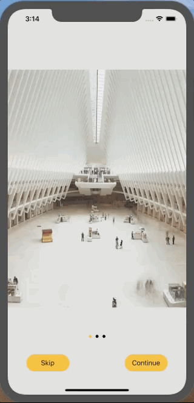

# iOS - Intro Screens

This demo provides Introduction screens in scrollview manner usually used at the startup of application. It manages dynamic views based on input images.

## Table of contents
- [iOS Support](#iOS-support)
- [Demo](#demo)
- [Features](#features)
- [Getting started](#getting-started)
- [Usage](#usage)
- [Methods](#methods)
- [Want to Contribute?](#want-to-contribute)
- [Need Help / Support?](#need-help)
- [Collection of Components](#collection-of-Components)
- [Changelog](#changelog)
- [License](#license)
- [Keywords](#Keywords)

## iOS Support

Versions: iOS 12, iOS 13

We have tested our program in above versions, however you can use it in other versions as well.

## Demo

------

## Features

* Introduction Screen demo app uses Scrollview and UIPageControl with Skip feature.
* This is a reusable component and you can add it in your iOS application.

## Getting started

Download this project and import 'App_Startup_gallery' folder contents in your project.

## Usage

### import App_Startup_gallery folder in your project 

* Make sure 'Images' folder should be added as 'group by reference' in your sample project.
* Setup below configuration in your root viewcontroller 

### Navigate to Startup component from your root viewcontroller.

e.g.

        let storyboard = UIStoryboard(name: "AppStartUp", bundle: nil)
        let secondVC = storyboard.instantiateViewController(identifier: "StartupGallery")
        
### This component use Images from "Images" folder", We can replace or add new images into it 

## Methods

### Below method for getting images from folder
e.g.

        let fm = FileManager.default
        let path = Bundle.main.resourcePath!
        print(path)
        do{
        let item = try fm.contentsOfDirectory(atPath: path).filter{$0.lowercased().hasSuffix(".png") || $0.lowercased().hasSuffix(".jpg")}
        arrImages.removeAll()
        for imgs in item{
            print(imgs)
            arrImages.append(UIImage(named:imgs)!)
            print(arrImages)
        }
        }catch let e{
            print("error  : \(e)")
        }
        
### Below method for loading images in Scrollview.
e.g.

     func loadScrollView() 

### Below Delegate method for getting current page number. 
e.g.

    func scrollViewDidEndDecelerating(_ scrollView: UIScrollView) {
    }
    
### Use this method for adding target on page control 
e.g.

    self.pageControl.addTarget(self, action: #selector(self.pageChanged(sender:)), for: UIControl.Event.valueChanged)
    @objc func pageChanged(sender:AnyObject)
       {
           let xVal = CGFloat(pageControl.currentPage) * imgScrollView.frame.size.width
           imgScrollView.setContentOffset(CGPoint(x: xVal, y: 0), animated: true)
           
       }
       
 ------
 
## Want to Contribute?

- Created something awesome, made this code better, added some functionality, or whatever (this is the hardest part).
- [Fork it](http://help.github.com/forking/).
- Create new branch to contribute your changes.
- Commit all your changes to your branch.
- Submit a [pull request](http://help.github.com/pull-requests/).

 ------

## Need Help? 

We also provide a free, basic support for all users who want to use this Intro Screens demo in project. In case you want to customize this code library to suit your development needs, then feel free to contact our [iOS
developers](https://www.weblineindia.com/hire-ios-app-developers.html).

 ------
 
## Collection of Components

We have built many other components and free resources for software development in various programming languages. Kindly click here to view our [Free Resources for Software Development.](https://www.weblineindia.com/communities.html)

------

## Changelog

 Detailed changes for each release are documented in [CHANGELOG](./CHANGELOG).

## License

 [MIT](LICENSE)

 [mit]: https://github.com/weblineindia/iOS-Intro-Screens/blob/master/LICENSE

## Keywords

App Introduction pages, Startup pages, Introduction screens, ScrollView images, PageControl gallery.
